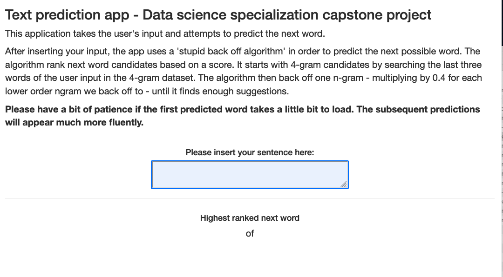

## Description of the app and how to use it

The app attempts to predict the next possible word of a sentence based of the user's input.

In order to use it, please insert your text in the text input box located at the center of the user interface.

<center>
{#id .class width=50% height=50%}
<center>

The app will recognize it and automatically generate a prediction for the next possible word.

Since the model has to be trained every time the app is launched, please have a bit of patience if the first predicted word takes a little bit to load. The subsequent predictions will appear much more fluently.

## The algortihm

The app uses a 'stupid back off algorithm' in order to predict the next possible word. The algorithm rank next word candidates based on a score. It starts with 4-gram candidates by searching the last three words of the user input in the 4-gram dataset. The algorithm then back off one n-gram - multiplying by 0.4 for each lower order n-gram we back off to - until it finds enough suggestions.

$$S(wi|w_{i−1}^{i−k+1}) = \begin{cases}
count(w^i_{i−k+1})/count(w^{i−1}_{i−k+1})  & \text{if $count(w_{i−k+1}^i)>0$} \\
λS(w_i|w^{i−1}_{i−k+2}) & \text{otherwise}
\end{cases}$$

With a lambda value empirically set to 0.4.

## Implementation of the model in R

Given the training corpus, the workflow for building the text-predictor consists of the following steps:

  * Preprocessing: Apply some transformations to the training corpus before k-gram extraction.
  * Sentence tokenization. Split the training corpus into n-grams
  * Extract k-gram frequencies. These are the building blocks for any n-gram language model.
  * Train the text predictor. Build a prediction function f, which takes some text input and returns as output a next-word prediction (or more than one, ordered by decreasing probability).

For implementing the stupid back off prediction function in R, the sbo package by Valerio Gherardi will be used. 
It provides utilities for building and evaluating next-word prediction functions based on Stupid Back-off N-gram models. 
  
## The prediction function

The prediction function from the sbo package contains following arguments and is the heart of the app:

```{r word coverage, echo=TRUE, eval = FALSE}
sbo_predictor(
 object,  #The training corpus used to train the text predictor.
 N ,  #The order N of the N-gram model
 dict ,  #The model dictionary
 .preprocess = identity, # The function used in corpus preprocessing
 EOS = "",  #End-Of-Sentence characters employed for sentence tokenization
 lambda = 0.4, #Back-off penalization in SBO algorithm
 L = 3L,  #Number of predictions for input
 filtered = "" #Words to exclude from next-word predictions
)
```             
